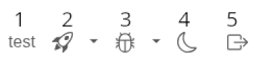
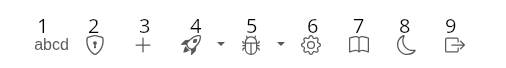

## Manual

### User roles

- Not verified 
    - can login but unable to create tests, add opening books, add engines..
- Verified 
    - can create tests, add opening books, add engines,...
- Admin 
    - approves (verify) not verified users
    - is able to:
        - delete users 
        - stop/delete tests

### Navigation menu

#### User is not logged

Navigation:

Description:
1. Test lists button (running, ended, passed)
2. Error lists button (worker errors, test errors)
3. Login button
4. Register button
5. Light/darkmode switch

#### User is logged and not verified

Navigation:

1. Profile button
2. Test lists button (running, ended, passed)
3. Error lists button (worker errors, test errors)
4. Light/darkmode switch
5. Logout button

#### User is logged and verified

Navigation:

Description:

1. Profile button
2. Create access token button
3. Create test button
4. Test lists button (running, ended, passed)
5. Error lists button (worker errors, test errors)
6. Engine management button
7. Opening book management button
8. Light/darkmode switch
9. Logout button

#### User is logged and admin

Navigation (same as verified user) + added user management button:

1. User management button

### Additional informations to the pages

#### Access token 
Access token is used on workers - for login.

#### Create test
- Expected NPS field - expected speed of the engine (our measurement) for workers.
- For autobenched test, there is one additional field - Confidence in range `(0.0001, 1]` - how many times `(1 / Confidence)` will be runned `bench` command on workers.

#### Engine management (Add engine)
- For git url we expect format (for example): `https://github.com/official-stockfish/Stockfish` 

- Requirements for build script:
    - Build is done in `/tmp/{generated_folder}`
    - Workers expect that built binary will be in the `/tmp/{generated_folder}/bencher_bin` and binary name is `engine`

### Requirements for the engine
- Implementation of the `bench` command that outputs `bench: xxx nps: yyy` on standart output.
    - Bench is usually set of positions for which we run search with fixed depth (for example 10).

